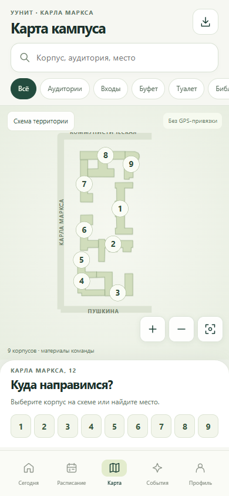
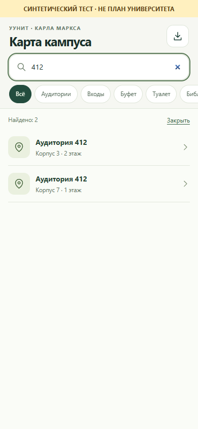
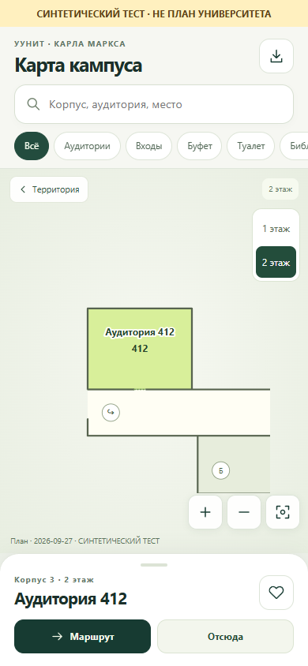
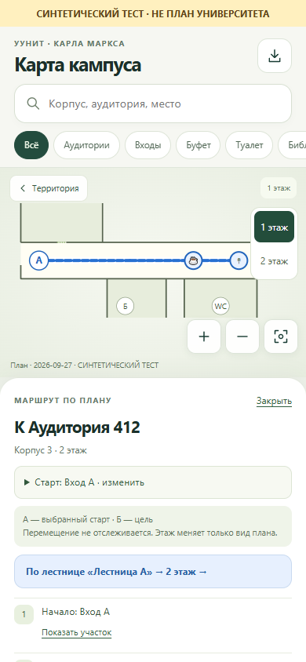

# Проверка модуля карты — 27 сентября 2026

## Реализовано в существующем приложении

- Карта занимает оставшуюся высоту экрана; поиск и фильтры сверху, компактная сворачиваемая карточка снизу. Карточка не лежит поверх цели.
- Девять исходных корпусов сохранены, фотографии и избранное работают. Контуры повёрнуты для портретного экрана, географические координаты не добавлялись.
- Перенос, масштаб двумя пальцами, кнопки масштаба, сброс, клавиатурное управление; номера корпусов сохраняют читаемый размер при изменении вида.
- Внутренние SVG-слои строятся из JSON: помещения, коридоры, стены, двери, важные объекты, этажи, выделение цели. Геометрия комнат сохраняется при отдалении; второстепенные номера скрываются.
- Поиск по корпусам, строковым номерам и синонимам. Неоднозначные совпадения выводятся списком с корпусом и этажом.
- Dijkstra по открытым направленным/двусторонним связям; маршрут к двери, шаги перехода этажей, ручной старт. Без сети и геолокации, без имитации отслеживания.
- Пара/мероприятие открывает точное место по стабильному ID либо однозначному номеру в подтверждённом корпусе. Старые `buildingId` поддерживаются; исходный текст сохраняется.
- Импорт JSON-набора прямо в приложении: валидация, предварительный просмотр, сохранение локально, восстановление встроенного набора. Ошибка не заменяет рабочие данные.
- Android учитывает системный масштаб текста вместо принудительных 100%. Локальный сервер предпросмотра отдаёт правильный MIME JavaScript на Windows.

## Что проверено

`node --test tests/core.test.js tests/map.test.js`: **21/21**. Включает прежние сценарии расписания и мероприятий, поиск, стабильные ссылки, маршруты одного/двух этажей, направленность, закрытые/служебные/непроверенные проходы, фильтр без ступеней, отсутствие пути, несуществующие объекты, двери, ссылки и пересечения стен.

`node tools/validate-maps.mjs`: встроенный набор валиден, **0 реальных этажей**.

`node tests/map-ui.mjs`: пройдено в изолированном Chrome с мобильными параметрами 390×844 и 320×500, сенсорным вводом, масштабом шрифта 150%. Проверены:

- территория, отсутствие плана и результата;
- открытие из ближайшей пары и мероприятия;
- сохранение импортированного набора после перезапуска;
- отказ от синтетического и повреждённого импорта без потери предыдущего набора;
- жесты двумя пальцами и перенос;
- неоднозначное «412», точное «3 корпус 412»;
- выбор этажа, старт маршрута только после явного выбора, сохранение старта при просмотре другого этажа;
- линия, переход по лестнице, цель у двери, отсутствие маршрута без ступеней.

Онлайн-API в браузерном тесте заблокированы. Геолокация не запрашивается. Встроенные ресурсы загружались через локальный сервер, аналогично их доставке из assets в Android; это не проверка нового APK в авиарежиме. Размер 320×500 проверяет ограниченную высоту, но не заменяет проверку настоящей Android-клавиатуры. Личный телефон и его данные не затрагивались.

## Скриншоты

| Территория — встроенные материалы | Поиск — синтетический тест |
| --- | --- |
|  |  |

| Этаж — синтетический тест | Маршрут — синтетический тест |
| --- | --- |
|  |  |

Дополнительно: [место из пары](map-review/03-lesson-place.png), [крупный шрифт](map-review/04-large-text.png), [цель на следующем этаже](map-review/08-route-destination-synthetic.png), [нет пути без ступеней](map-review/09-no-route-synthetic.png).

Тестовые этажи **не являются планами УУНиТ**. Баннер на скриншотах обязателен при использовании этих кадров на защите. Они показывают работу компонентов, а не покрытие университета.

## Остаётся до реального пилота

Команда пока не передала планы этажей, двери, проверенные входы и ограничения проходов. Поэтому ни один реальный внутренний маршрут не заявлен и не проверен на месте. Нельзя выбрать достоверный пилот только по имеющейся схеме корпусов. После получения материалов подготовьте набор по [инструкции](MAPS.md), пройдите маршруты на месте и укажите источник/дату проверки.

APK этой версии **не собран**: в текущем окружении нет настроенного JDK и SDK Platform 35 / Build Tools 35.0.0. Существующий релиз не заменялся. Новую тестовую сборку следует выпустить отдельно и явно указать версию; при отсутствии общего ключа она будет подписана другим ключом и может не установиться поверх старой. Android-импорт через системный выбор файла, системный шрифт, клавиатура и офлайн-перезапуск APK ещё требуют проверки на отдельном тестовом устройстве.
